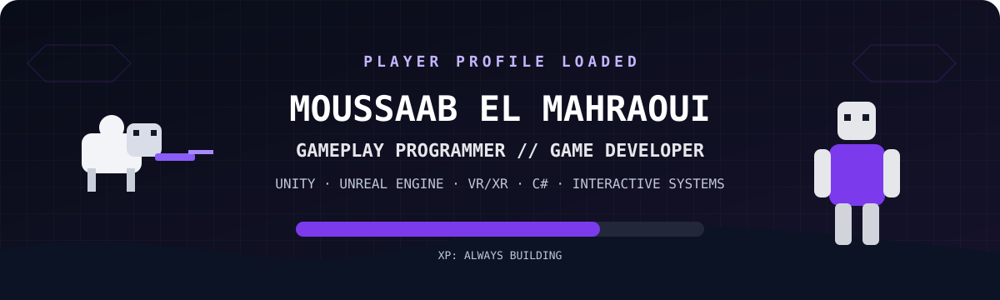

<!--
  GitHub profile README for Moussaab El Mahraoui.
  Run `python setup_profile.py` to add verified contact links and the contribution snake.
-->

  

### `PLAYER 01 — MOUSSAAB EL MAHRAOUI`

**Gameplay Programmer · Unity / C# · Unreal Engine · VR/XR**

Based in Morocco · Open to game-development and immersive-technology opportunities

<!-- PROFILE_LINKS_START -->

<!-- PROFILE_LINKS_END -->

## 🎮 PLAYER PROFILE — About Me

I build games, immersive experiences, gameplay systems, and interactive prototypes across mobile, PC, VR/XR, and interactive installations. My core work is in **Unity, C#, gameplay programming, and VR/XR**, with professional Unreal Engine 5 experience.

My work includes player controllers, camera systems, gameplay AI, interaction mechanics, UI, progression, performance profiling, and maintainable gameplay architecture.

## 🐑 MAIN QUEST — Sheep with Guns

> **Solo Developer · Unity · Tower-Offense Strategy**

**Sheep with Guns** is a strategy game in which a sheep army attacks wolf-controlled bases while surviving defensive turrets and enemy counterattacks. Its systems include combat, enemy waves, resources, progression, sheep permadeath, and short strategic sessions.

**Current direction:** expanding unit classes, map conquest, progression, cosmetics, and replayable runs.

## ⚔️ QUEST LOG — Selected Projects

### Lost in Sala Colonia

**Unity · PC VR · XR Interaction Toolkit**

A VR graduation project set in a Chellah-inspired environment at night. It combines exploration and horror atmosphere with a vlogger camera, a Head Collector enemy, and laser/mirror, electricity-cable, and Zellij mosaic puzzles.

### ZAMZAMAN

**Unity · Gameplay Programming**

A Bomberman-inspired game featuring grid movement, sliding, bombs, destructible and indestructible blocks, a chaser enemy, and a boss encounter.

### Kasbah

**Unreal Engine · First-Person Narrative Prototype**

A first-person exploration prototype set in a Moroccan kasbah, with hydration, death and respawn, dialogue, quests, a story journal, tutorials, save/load, audio polish, and gameplay interactions.

### Hospital Anomaly

**Unity · Gameplay Prototype**

A hospital anomaly prototype built around patient inspection, doctor interaction, anomaly containment, escort mechanics, AI movement, enemy spawning, animation systems, and level progression.

### SAQR — Interactive Technology Side Project

**Web · Python · Microservices · AI/RAG**

A drone-pilot training platform, initially focused on agriculture. It is a software and training project rather than a game.

## 🎒 INVENTORY — Core Skills

**Game development:** Unity · Unreal Engine · C# · C++ · Gameplay systems · Mobile game development

**Immersive:** VR/XR · XR Interaction Toolkit · PC VR · AR prototyping · Immersive UX

**Tools:** Git · GitHub · Blender

**Software and AI:** Python · JavaScript · Microservices · RAG experimentation

## 🏆 ACHIEVEMENTS — Experience

- **3rd place — Inwi Student Mobile Game Competition:** game development and prototyping.
- **Unity Performance Optimization:** improved average frame rate by approximately 35% and reduced draw calls by 25% on target hardware at RPPG Interactive.
- **Game Development Instructor:** designed and delivered Unity curricula for beginner through advanced learners at Geeks Institute / LaStartupStation.
- **VR Development:** built Unity training environments and anatomical assets used for medical education at Institut National d'Oncologie.

## 💼 CAMPAIGN HISTORY — Professional Experience

### Gameplay Programmer / Unreal Engine Developer · Ribat Studios

`March 2026 — August 2026`

Developed and refactored first-person systems for **Kasbah** in Unreal Engine 5, including hydration, respawn, dialogue, journal, tutorials, interactions, audio, UI state management, AI controllers, Behavior Trees, and reusable Blueprint components. Produced technical documentation and collaborated in an Agile production environment using Diversion version control.

### Gaming Instructor · Geeks Institute / LaStartupStation

`October 2025 — August 2026`

Designed and delivered Unity curricula, supervised projects from prototype to playable demo, and provided code review, debugging, architecture, and game-design guidance.

### Game Developer / Unity Developer · RPPG Interactive

`August 2025 — February 2026`

Implemented a player controller, third-person camera rig, UI state machine, game-state manager, physics interactions, and enemy Behavior Tree AI. Optimized the rendering pipeline and collaborated with designers, artists, and engineers throughout a six-month production cycle.

### Earlier Interactive-Technology Experience

- **Full Stack Developer · Cyberleet (2024):** built a hospital appointment platform with a REST API and responsive interface.
- **Metaverse Developer · NEODMCC (2023):** created Unity and Blender environments and developed a multiplayer poker module.
- **VR Developer · Institut National d'Oncologie (2022):** built interactive Unity training environments and anatomical 3D assets.

## 🧑‍🏫 GUILD ROLE — Teaching and Mentoring

I teach Unity foundations, input and movement, physics, UI, animation, audio, architecture, VFX, deployment, save systems, and design patterns. My teaching approach is simple: understand the system, build it cleanly, and then make it feel good.

## 🎓 TRAINING PATH — Education

- **Video Game Creator** — ISART Digital / Université Internationale de Rabat, 2025
- **Bachelor's Degree in Software Development** — SUPEMIR, 2024–2025
- **Software Engineer Program** — ALX Africa, 2023–2024
- **AR/VR Developer and Designer** — Interactive Digital Centre / UM6P, 2022
- **Full Stack Development Specialist** — ISTA NTIC SYBA / OFPPT, 2021–2023

## 🐍 MINIGAME — GitHub Activity

<!-- CONTRIBUTION_SNAKE_START -->

  <picture>
    <source media="(prefers-color-scheme: dark)" srcset="https://raw.githubusercontent.com/iammoussaab/iammoussaab/output/github-snake-dark.svg">
    <source media="(prefers-color-scheme: light)" srcset="https://raw.githubusercontent.com/iammoussaab/iammoussaab/output/github-snake.svg">
    
  </picture>

<!-- CONTRIBUTION_SNAKE_END -->

## 🚪 PORTALS — Contact and Work

  

`THANKS FOR PLAYING`

**MOUSSAAB EL MAHRAOUI — GAMEPLAY PROGRAMMER**

